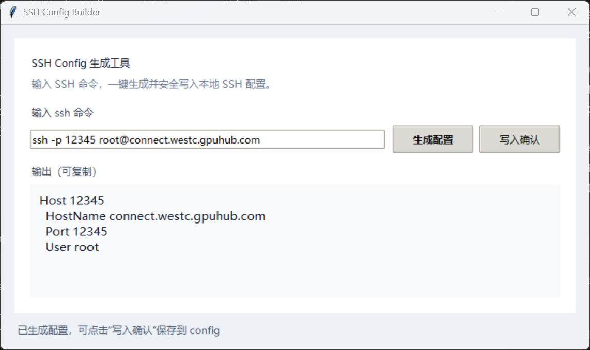

# autodl_ssh_tool

面向 **AutoDL / GPU 云主机** 等场景的轻量小工具：把控制台里常见的

`ssh -p <端口> <用户>@<主机>`

一键转换成 **OpenSSH 客户端可用的 `Host` 配置片段**，支持复制到剪贴板，也可 **确认后追加写入** 本机 `~/.ssh/config`。

界面基于 Python 自带 **tkinter**，无额外运行时依赖；可选打包为 Windows 单文件 `exe` 分发。

## 功能概览

- **解析 SSH 命令**：识别 `ssh -p 端口 用户@主机` 形式（端口、用户、主机名必填）。
- **生成配置**：输出标准片段，其中 `Host` 别名使用 **端口号**（便于区分多台实例）。
- **写入确认**：二次确认后，将当前输出 **追加** 到用户目录下的 `~/.ssh/config`（若 `.ssh` 不存在会自动创建）。
- **状态提示**：底部状态栏提示生成与写入结果。

### 界面预览



### 生成示例

输入：

```text
ssh -p 23497 root@connect.westc.gpuhub.com
```

生成（示意）：

```text
Host 23497
  HostName connect.westc.gpuhub.com
  Port 23497
  User root
```

之后在终端可使用：

```text
ssh 23497
```

（具体是否还需 `IdentityFile` 等，请按你本机密钥习惯自行在 `config` 里补充。）

## 环境要求

- **Python 3**（建议 3.10+）
- **tkinter**（Windows 下多数 Python 安装已包含；若缺失请按所用发行版说明安装 Tcl/Tk。）

## 本地运行

```bash
python ssh_tool.py
```

## 打包为 Windows exe（可选）

安装 PyInstaller 后，在项目根目录执行：

```bash
pip install pyinstaller
python -m PyInstaller ssh_tool.spec
```

生成物位于 `dist/ssh_tool.exe`（单文件、无控制台窗口）。

自定义图标时，可在打包命令或 `ssh_tool.spec` 的 `EXE(...)` 中增加 `icon='your.ico'`（需自行准备 `.ico` 文件）。

## 配置写入说明

- 写入路径为：**当前用户主目录** 下的 `.ssh/config`，即 `Path.home() / ".ssh" / "config"`。
- Windows 上一般为：`C:\Users\<你的用户名>\.ssh\config`。
- 采用 **追加** 写入；若文件已存在内容，会在新片段前插入空行分隔。重复生成同名 `Host` 可能导致冲突，请自行编辑 `config` 合并或删除重复段。

## 项目结构（主要文件）

| 文件 | 说明 |
|------|------|
| `ssh_tool.py` | 程序入口与界面逻辑 |
| `ssh_tool.spec` | PyInstaller 打包配置 |
| `.gitignore` | 忽略构建产物、缓存等 |
| `LICENSE` | MIT 许可证全文 |

## 许可证

本项目采用 **MIT License**，详见仓库根目录 [`LICENSE`](LICENSE) 文件。
